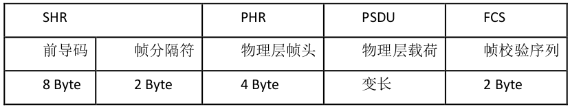
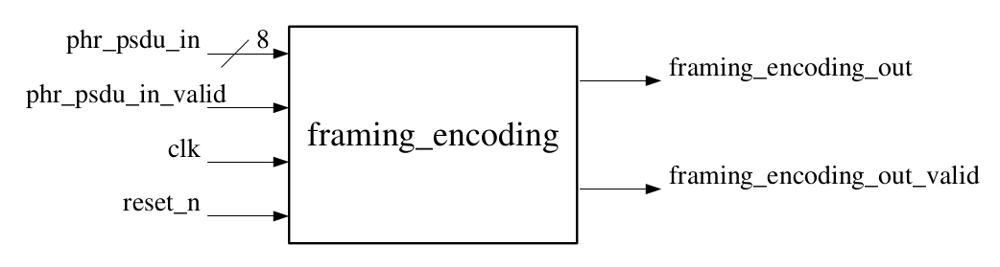
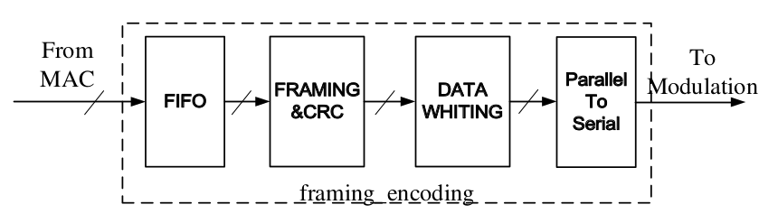
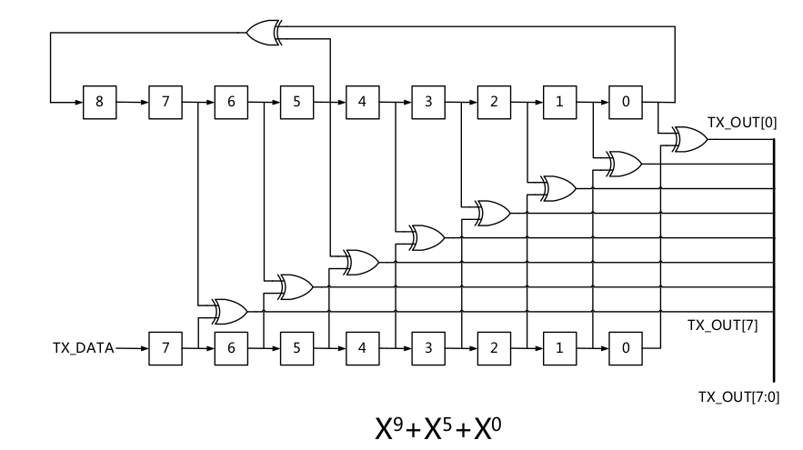
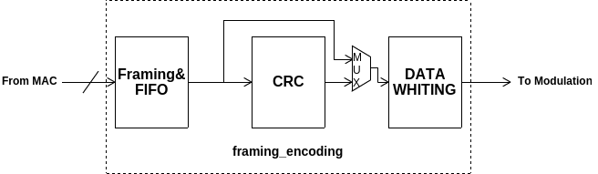

# 物理层组帧编码 *framing_encoding*

## 编码结构



## 顶层设计

### 模块接口



```verilog
    input clk;
    input reset_n;
    input [7:0] phr_psdu_in;
    input phr_psdu_in_valid;

    output framing_encoding_out;
    output framing_encoding_out_valid;
```

### 内部结构



## 原理分析

### FIFO *(First In First Out)*

* 输入端口直接与外部相连，输入数据为`1 Byte @(posedge clk)`;

* 输出端口与下级模块`CRC`相连，具体输出形式依赖于`CRC`模块采用*串行输入*or*并行输入*;

* 输入输出均有`valid`使能信号;

* 若采用串行输出`1 Bit @(posedge clk)`，由于输入输出速率不匹配，故`FIFO`内部需要一定大小的存储器，防止数据阻塞丢失;

* 若`CRC`模块采用`8 Bits`并行输入，那么`FIFO`模块可以省略;

### CRC *(Cyclic Redundancy Check)*

#### 串入并出


* 输入数据从低位到高位依次从`TX_DATA`输入，当数据全部输入后，此时对应的`TX_OUT[15:0]`即`CRC`产生的16位`FCS`码;

* 记图中16个D触发器当前状态为`fcs_n[15:0]`，则`fcs_n`状态转移过程如下

```verilog
    always @(posedge clk) begin
        fcs_n <= {fcs_n[0]^TX_DATA, fcs_n[15:12],
                  fcs_n[11]^fcs_n[0]^TX_DATA, fcs_n[10:5],
                  fcs_n[4]^fcs_n[0]^TX_DATA, fcs_n[3:1]};
    end
    
    assign TX_OUT = ~fcs_n;
```

#### 并入并出

* 根据串入并出可推导出，输入`8 Bits`数据后，`fcs_n`的变化：

```verilog
    always @(posedge clk) begin
        fcs_n1 <= {fcs_n[0]^TX_DATA[0], fcs_n[15:12],
                   fcs_n[11]^fcs_n[0]^TX_DATA[0], fcs_n[10:5],
                   fcs_n[4]^fcs_n[0]^TX_DATA[0], fcs_n[3:1]};
		fcs_n2 <= {fcs_n1[0]^TX_DATA[1], fcs_n1[15:12],
                   fcs_n1[11]^fcs_n1[0]^TX_DATA[1], fcs_n1[10:5],
                   fcs_n1[4]^fcs_n1[0]^TX_DATA[1], fcs_n1[3:1]};
        fcs_n3 <= {fcs_n2[0]^TX_DATA[2], fcs_n2[15:12],
                   fcs_n2[11]^fcs_n2[0]^TX_DATA[2], fcs_n2[10:5],
                   fcs_n2[4]^fcs_n2[0]^TX_DATA[2], fcs_n2[3:1]};
        fcs_n4 <= {fcs_n3[0]^TX_DATA[3], fcs_n3[15:12],
                   fcs_n3[11]^fcs_n3[0]^TX_DATA[3], fcs_n3[10:5],
                   fcs_n3[4]^fcs_n3[0]^TX_DATA[3], fcs_n3[3:1]};
        fcs_n5 <= {fcs_n4[0]^TX_DATA[4], fcs_n4[15:12],
                   fcs_n4[11]^fcs_n4[0]^TX_DATA[4], fcs_n4[10:5],
                   fcs_n4[4]^fcs_n4[0]^TX_DATA[4], fcs_n4[3:1]};
        fcs_n6 <= {fcs_n5[0]^TX_DATA[5], fcs_n5[15:12],
                   fcs_n5[11]^fcs_n5[0]^TX_DATA[5], fcs_n5[10:5],
                   fcs_n5[4]^fcs_n5[0]^TX_DATA[5], fcs_n5[3:1]};
        fcs_n7 <= {fcs_n6[0]^TX_DATA[6], fcs_n6[15:12],
                   fcs_n6[11]^fcs_n6[0]^TX_DATA[6], fcs_n6[10:5],
                   fcs_n6[4]^fcs_n6[0]^TX_DATA[6], fcs_n6[3:1]};
        fcs_n <= {fcs_n7[0]^TX_DATA[7], fcs_n7[15:12],
                  fcs_n7[11]^fcs_n7[0]^TX_DATA[7], fcs_n7[10:5],
                  fcs_n7[4]^fcs_n7[0]^TX_DATA[7], fcs_n7[3:1]};
    end
    
    assign TX_OUT = ~fcs_n;
```

#### 串行输出

* 只需在产生并行结果`TX_OUT[15:0]`后，进行移位输出即可;

### Data Whiting

#### 串入并出



#### 串入串出

* 输入数据直接与当前伪随机序列的最低位异或，得到的结果即输出数据;

```verilog
    assign TX_OUT = pseudo_rand[0] ^ TX_DATA;
```

* 伪随机序列`pseudo_rand[8:0]`演化过程如下

```verilog
    always @(posedge clk) begin
        pseudo_rand <= {pseudo_rand[5]^pseudo_rand[0], pseudo_rand[8:1]};
    end
```

### 综合考虑

* 由于输入`8 Bits @(posedge clk)`与输出`1 Bit @(posedge clk)`的不匹配，各模块之间用并行方式进行连接只能为`CRC`和`WHITING`提速，从整体上看，最终并转串总会使输出速率降低;

* 因此尝试在各模块之间用串行信号通信（串入串出白化编码模块较易实现）


* 编码过程：
    
    1. `FIFO`接收输入数据，存于存储器，一旦检测到有数据输入则开始串行输出编码的`80 Bits SHR`部分，`SHR`输出完毕后紧接着串行输出`PHR`和`PSDU`，此过程中`fifo_output_valid`有效;
    
    2. `WHITING`在`fifo_output_valid`有效时接收`FIFO`输出的`{SHR, PHR, PSDU}`，接收`SHR`时`WHITING`相当于`buffer`，接收`{PHR, PSDU}`时从低位开始逐位白化;
    
    3. `CRC`在`fifo_output_valid`有效时接收`FIFO`输出的`{SHR, PHR, PSDU}`，接收`SHR`时无操作，接收`{PHR, PSDU}`开始计算`FCS`，当`fifo_output_valid`无效时`FCS`计算完成，开始串行输出，`crc_output_valid`有效;
    
    4. `WHITING`在`crc_output_valid`有效时接收`CRC`输出串行`FCS`编码，此时`{PHR, PSDU}`正好白化完成并已输出，紧接着对`FCS`逐位白化，白化完成即整个编码过程结束;

## 模块实现

### fifo

### 端口

```verilog
    input clk;                  // 10kHz
    input reset_n;              // low active
    input [7:0] fifo_input;     // 1 Byte data in @(posedge clk)
    input fifo_input_valid;     // high active
    
    output fifo_output;         // 1 bit data out @(posedge clk)
    output fifo_output_valid;   // high active
```

### 实现机制

* 存储器解决进出速率不匹配问题

```verilog
    reg [7:0] memory [7:0];     // 8 Bytes memory
    reg [2:0] count;            // count Bytes already stored in memory
    reg [2:0] col, read_row;    // point to bit memory ready to output
    reg [2:0] write_row;        // point to next empty row in memory
                                // for storing input data
```

* 从第一字节数据中获取码长信息

```verilog
    reg read_data_size;         // high active when a new datastream starts
    reg [7:0] data_size;        // data size got from first Byte
    reg [7:0] send_count;       // count Bytes already sent out, 
                                // when send_count == data_size, 
                                // read_data_size turns into high active
```

* 组合`SHR`编码，先输出`SHR`，再输出`PHR`和`PSDU`

```verilog
    reg [79:0] shr;             // 10 Bytes SHR code
    reg [6:0] shr_count;        // count whether SHR ends
```

### crc

- input:
    + clk: 10kHz
    + reset_n: asynchronous reset active low
    + tx_data: 1 bit data in
    + tx_data_valid: high active, data valid

- output:
    + tx_out: 1 bit serial output

- how it works:
    + input serial data starts with SHR code (10 Bytes)
        + [6:0] shr_count: count from 0 to 79
    + FCS of {PHR, PSDU}
        + [15:0] fcs_n: 16 dffs, tx_out = ~fcs_n, keep refreshing until tx_data_valid turns into low, then get the FCS code
    + serial output
        + [3:0] fcs_count: count from 0 to 15, to output fcs serially
        + tx_out_valid: high active when outputing fcs

```verilog
    [7:0] data;
```
