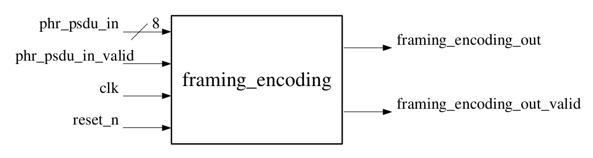

# 物理层组帧编码 *framing_encoding*

## 顶层设计

### 模块接口



```vhdl
    input clk;
    input reset_n;
    input [7:0] phr_psdu_in;
    input phr_psdu_in_valid;

    output framing_encoding_out;
    output framing_encoding_out_valid;
```

### 内部结构


## 原理分析


## modules

### fifo

- input: 
    + clk: 10kHz
    + reset_n
    + [7:0] fifo_input: 1 Byte data @(posedge clk)
    + fifo_input_valid: high active, data valid

- output: 
    + fifo_output: 1 bit data @(posedge clk)
    + fifo_output_valid: high active, output valid

- how it works:
    + 8 bits in and 1 bit out @(posedge clk), using memory to store input data
        + [7:0] memory [7:0]: 8 Bytes memory
        + [2:0] count: count Bytes already stored in memory
        + [2:0] col, read_row: point to bit memory ready to output
        + [2:0] write_row: point to next empty row in memory for storing input data
    + get PSDU's length info in first Byte of datastream
        + read_data_size: high active when a new datastream starts
        + [7:0] data_size: Bytes of data
        + [7:0] send_count: count Bytes already sent out, when send_count == data_size, read_data_size high active
    + framing SHR code, output SHR first, then PHR and PSDU
        + [79:0] shr: 10 Bytes SHR code
        + [6:0] shr_count: count whether SHR ends

### crc

- input:
    + clk: 10kHz
    + reset_n: asynchronous reset active low
    + tx_data: 1 bit data in
    + tx_data_valid: high active, data valid

- output:
    + tx_out: 1 bit serial output

- how it works:
    + input serial data starts with SHR code (10 Bytes)
        + [6:0] shr_count: count from 0 to 79
    + FCS of {PHR, PSDU}
        + [15:0] fcs_n: 16 dffs, tx_out = ~fcs_n, keep refreshing until tx_data_valid turns into low, then get the FCS code
    + serial output
        + [3:0] fcs_count: count from 0 to 15, to output fcs serially
        + tx_out_valid: high active when outputing fcs

```vhdl
    [7:0] data;
```
