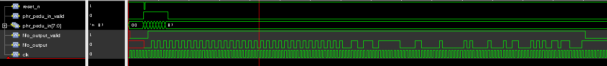
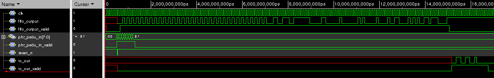
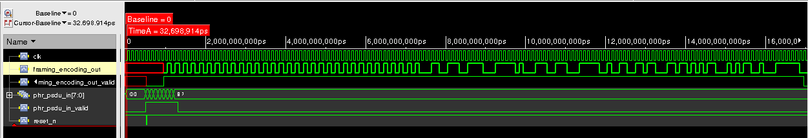
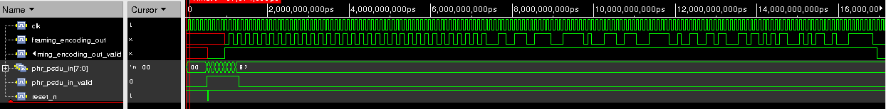
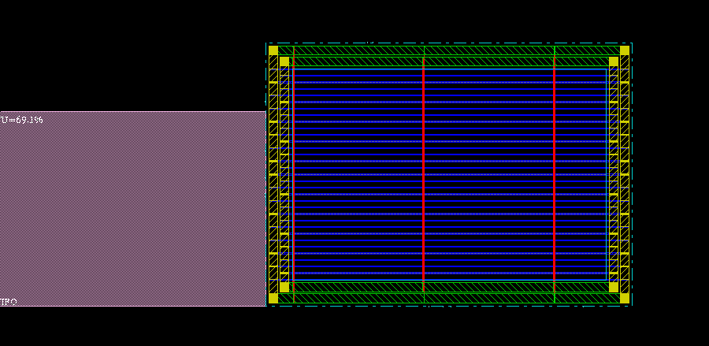
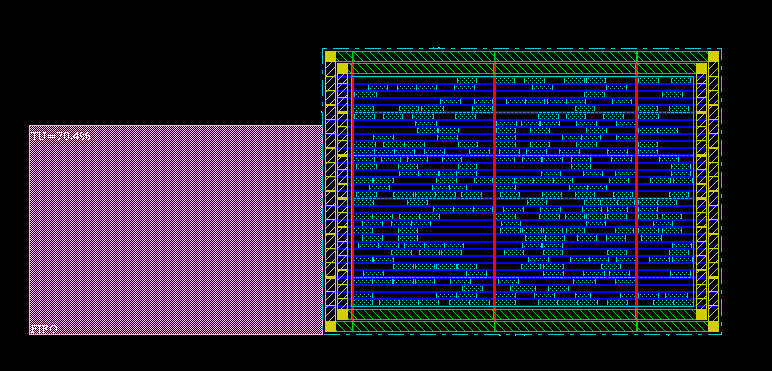
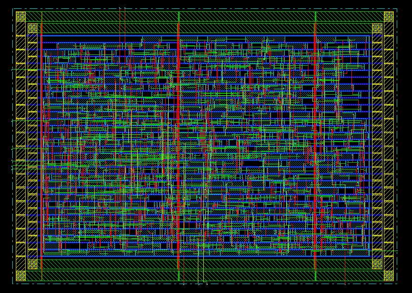
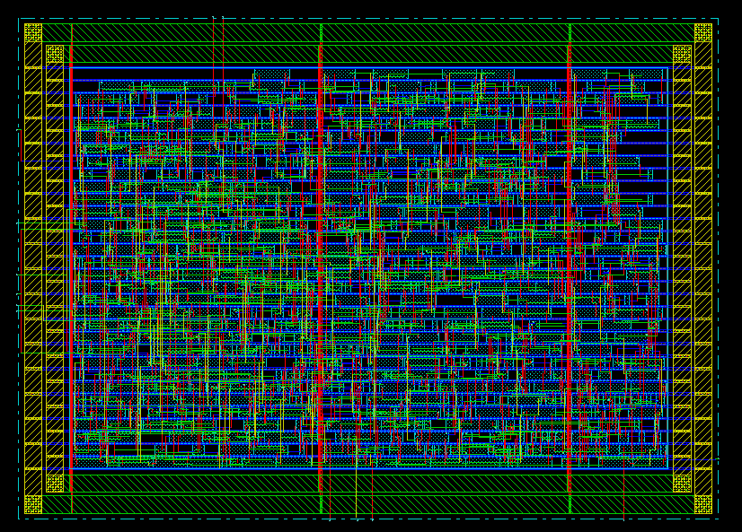
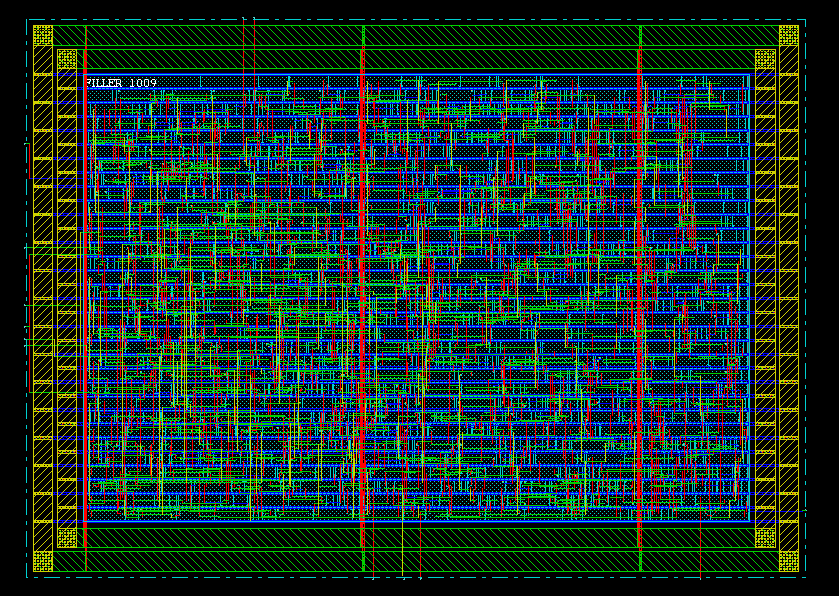
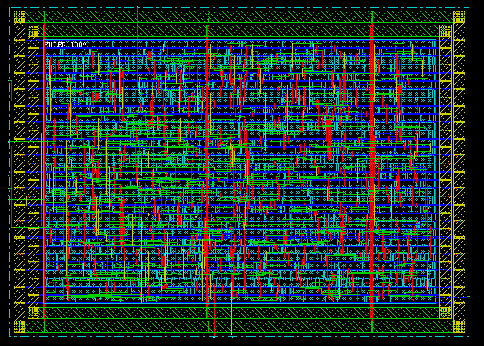

# 物理层组帧编码 *framing_encoding*

## 编码结构


## 顶层设计

### 模块接口


```verilog
    input clk;
    input reset_n;
    input [7:0] phr_psdu_in;
    input phr_psdu_in_valid;

    output framing_encoding_out;
    output framing_encoding_out_valid;
```

### 内部结构


## 原理分析

### FIFO *(First In First Out)*

* 输入端口直接与外部相连，输入数据为`1 Byte @(posedge clk)`;

* 输出端口与下级模块`CRC`相连，具体输出形式依赖于`CRC`模块采用*串行输入*or*并行输入*;

* 输入输出均有`valid`使能信号;

* 若采用串行输出`1 Bit @(posedge clk)`，由于输入输出速率不匹配，故`FIFO`内部需要一定大小的存储器，防止数据阻塞丢失;

* 若`CRC`模块采用`8 Bits`并行输入，那么`FIFO`模块可以省略;

### CRC *(Cyclic Redundancy Check)*

#### 串入并出


* 输入数据从低位到高位依次从`TX_DATA`输入，当数据全部输入后，此时对应的`TX_OUT[15:0]`即`CRC`产生的16位`FCS`码;

* 记图中16个D触发器当前状态为`fcs_n[15:0]`，则`fcs_n`状态转移过程如下

```verilog
    always @(posedge clk) begin
        fcs_n <= {fcs_n[0]^TX_DATA, fcs_n[15:12],
                  fcs_n[11]^fcs_n[0]^TX_DATA, fcs_n[10:5],
                  fcs_n[4]^fcs_n[0]^TX_DATA, fcs_n[3:1]};
    end
    
    assign TX_OUT = ~fcs_n;
```

#### 并入并出

* 根据串入并出可推导出，输入`8 Bits`数据后，`fcs_n`的变化：

```verilog
    always @(posedge clk) begin
        fcs_n1 <= {fcs_n[0]^TX_DATA[0], fcs_n[15:12],
                   fcs_n[11]^fcs_n[0]^TX_DATA[0], fcs_n[10:5],
                   fcs_n[4]^fcs_n[0]^TX_DATA[0], fcs_n[3:1]};
		fcs_n2 <= {fcs_n1[0]^TX_DATA[1], fcs_n1[15:12],
                   fcs_n1[11]^fcs_n1[0]^TX_DATA[1], fcs_n1[10:5],
                   fcs_n1[4]^fcs_n1[0]^TX_DATA[1], fcs_n1[3:1]};
        fcs_n3 <= {fcs_n2[0]^TX_DATA[2], fcs_n2[15:12],
                   fcs_n2[11]^fcs_n2[0]^TX_DATA[2], fcs_n2[10:5],
                   fcs_n2[4]^fcs_n2[0]^TX_DATA[2], fcs_n2[3:1]};
        fcs_n4 <= {fcs_n3[0]^TX_DATA[3], fcs_n3[15:12],
                   fcs_n3[11]^fcs_n3[0]^TX_DATA[3], fcs_n3[10:5],
                   fcs_n3[4]^fcs_n3[0]^TX_DATA[3], fcs_n3[3:1]};
        fcs_n5 <= {fcs_n4[0]^TX_DATA[4], fcs_n4[15:12],
                   fcs_n4[11]^fcs_n4[0]^TX_DATA[4], fcs_n4[10:5],
                   fcs_n4[4]^fcs_n4[0]^TX_DATA[4], fcs_n4[3:1]};
        fcs_n6 <= {fcs_n5[0]^TX_DATA[5], fcs_n5[15:12],
                   fcs_n5[11]^fcs_n5[0]^TX_DATA[5], fcs_n5[10:5],
                   fcs_n5[4]^fcs_n5[0]^TX_DATA[5], fcs_n5[3:1]};
        fcs_n7 <= {fcs_n6[0]^TX_DATA[6], fcs_n6[15:12],
                   fcs_n6[11]^fcs_n6[0]^TX_DATA[6], fcs_n6[10:5],
                   fcs_n6[4]^fcs_n6[0]^TX_DATA[6], fcs_n6[3:1]};
        fcs_n <= {fcs_n7[0]^TX_DATA[7], fcs_n7[15:12],
                  fcs_n7[11]^fcs_n7[0]^TX_DATA[7], fcs_n7[10:5],
                  fcs_n7[4]^fcs_n7[0]^TX_DATA[7], fcs_n7[3:1]};
    end
    
    assign TX_OUT = ~fcs_n;
```

#### 串行输出

* 只需在产生并行结果`TX_OUT[15:0]`后，进行移位输出即可;

### Data Whiting

#### 串入并出


#### 串入串出

* 输入数据直接与当前伪随机序列的最低位异或，得到的结果即输出数据;

```verilog
    assign TX_OUT = pseudo_rand[0] ^ TX_DATA;
```

* 伪随机序列`pseudo_rand[8:0]`演化过程如下

```verilog
    always @(posedge clk) begin
        pseudo_rand <= {pseudo_rand[5]^pseudo_rand[0], pseudo_rand[8:1]};
    end
```

### 综合考虑

* 由于输入`8 Bits @(posedge clk)`与输出`1 Bit @(posedge clk)`的不匹配，各模块之间用并行方式进行连接只能为`CRC`和`WHITING`提速，从整体上看，最终并转串总会使输出速率降低;

* 因此尝试在各模块之间用串行信号通信（串入串出白化编码模块较易实现）


* 编码过程：
    
    1. `FIFO`接收输入数据，存于存储器，一旦检测到有数据输入则开始串行输出编码的`80 Bits SHR`部分，`SHR`输出完毕后紧接着串行输出`PHR`和`PSDU`，此过程中`fifo_output_valid`有效;
    
    2. `WHITING`在`fifo_output_valid`有效时接收`FIFO`输出的`{SHR, PHR, PSDU}`，接收`SHR`时`WHITING`相当于`buffer`，接收`{PHR, PSDU}`时从低位开始逐位白化;
    
    3. `CRC`在`fifo_output_valid`有效时接收`FIFO`输出的`{SHR, PHR, PSDU}`，接收`SHR`时无操作，接收`{PHR, PSDU}`开始计算`FCS`，当`fifo_output_valid`无效时`FCS`计算完成，开始串行输出，`crc_output_valid`有效;
    
    4. `WHITING`在`crc_output_valid`有效时接收`CRC`输出串行`FCS`编码，此时`{PHR, PSDU}`正好白化完成并已输出，紧接着对`FCS`逐位白化，白化完成即整个编码过程结束;

## 模块实现

### fifo

#### 端口

```verilog
    input clk;                  // 10kHz
    input reset_n;              // low active
    input [7:0] fifo_input;     // 1 Byte data in @(posedge clk)
    input fifo_input_valid;     // high active
    
    output fifo_output;         // 1 bit data out @(posedge clk)
    output fifo_output_valid;   // high active
```

#### 实现机制

* 存储器解决进出速率不匹配问题

```verilog
    reg [7:0] memory [7:0];     // 8 Bytes memory
    reg [2:0] count;            // count Bytes already stored in memory
    reg [2:0] col, read_row;    // point to bit memory ready to output
    reg [2:0] write_row;        // point to next empty row in memory
                                // for storing input data
```

* 从第一字节数据中获取码长信息

```verilog
    reg read_data_size;         // high active when a new datastream starts
    reg [7:0] data_size;        // data size got from first Byte
    reg [7:0] send_count;       // count Bytes already sent out, 
                                // when send_count == data_size, 
                                // read_data_size turns into high active
```

* 组合`SHR`编码，先输出`SHR`，再输出`PHR`和`PSDU`

```verilog
    reg [79:0] shr;             // 10 Bytes SHR code
    reg [6:0] shr_count;        // count whether SHR ends
```

#### 功能仿真



### crc

#### 端口

```verilog
    input clk;
    input reset_n;
    input tx_data;              // 1 bit data in @(posedge clk)
    input tx_data_valid;
    
    output tx_out;              // 1 bit data out @(posedge clk)
    output tx_out_valid;
```

#### 实现机制

* 串行输入含`SHR`的数据

```verilog
    reg [6:0] shr_count;        // count from 0 to 79, to count SHR
```

* 16个D触发器实现`FCS`码计算

```verilog
    reg [15:0] fcs_n;           // keep refreshing until tx_data_valid -> low
```

* 串行输出

```verilog
    reg [3:0] fcs_count;        // count from 0 to 15, to output fcs serially
    reg tx_out_valid;           // high active when outputing fcs
```

#### 功能仿真



### whiting

#### 端口

```verilog
    input clk;
    input reset_n;
    input tx_data;              // 1 bit data in @(posedge clk)
    input tx_data_valid;
    
    output tx_out;              // 1 bit data out @(posedge clk)
    output tx_out_valid;
```

#### 实现机制

* 伪随机序列生成

```verilog
    reg [8:0] pseudo_rand;      // 9 bits pseudo random sequence
```

* 接收`SHR`码不白化直接输出

```verilog
    reg [6:0] shr_count;        // count from 0 to 79
```

## NC仿真

### 功能仿真



输出结果**正确**

## DC综合

```
****************************************

Library(s) Used:

    typical (File: /soft1/course_lib_umc18/tt_1v8_25c.db)

Number of ports:               13
Number of nets:                19
Number of cells:                4
Number of references:           4

Combinational area:       10857.369742
Noncombinational area:    16306.012917
Net Interconnect area:    104627.203186

Total cell area:          27163.382659
Total area:               131790.585845
 
****************************************
Report : area
Design : framing_encoding
Version: D-2010.03
Date   : Sat Jun 13 22:54:19 2015
****************************************
```

```
****************************************

Operating Conditions: typical   Library: typical
Wire Load Model Mode: top

  Startpoint: FIFO/count_reg[1]
              (rising edge-triggered flip-flop clocked by clk)
  Endpoint: FIFO/send_count_reg[0]
            (rising edge-triggered flip-flop clocked by clk)
  Path Group: clk
  Path Type: max

  Des/Clust/Port     Wire Load Model       Library
  ------------------------------------------------
  framing_encoding   umc18_wl10            typical

  Point                                    Incr       Path
  -----------------------------------------------------------
  clock clk (rise edge)                    0.00       0.00
  clock network delay (ideal)              0.00       0.00
  FIFO/count_reg[1]/CK (DFFRHQX1)          0.00       0.00 r
  FIFO/count_reg[1]/Q (DFFRHQX1)           0.64       0.64 r
  FIFO/U288/Y (OR4X2)                      0.19       0.82 r
  FIFO/U51/Y (INVX2)                       0.09       0.92 f
  FIFO/U42/Y (INVX2)                       0.11       1.03 r
  FIFO/U11/Y (INVX2)                       0.10       1.13 f
  FIFO/U49/Y (NOR2X1)                      0.79       1.92 r
  FIFO/U145/Y (AND2X1)                     0.22       2.14 r
  FIFO/U152/Y (NAND2X1)                    0.16       2.30 f
  FIFO/U50/Y (NOR2X1)                      0.63       2.92 r
  FIFO/U41/Y (INVX2)                       0.46       3.38 f
  FIFO/U47/Y (NOR2X1)                      0.84       4.22 r
  FIFO/U285/Y (NAND2X1)                    0.07       4.29 f
  FIFO/U284/Y (OAI2BB1X1)                  0.15       4.44 r
  FIFO/send_count_reg[0]/D (DFFRHQX1)      0.00       4.44 r
  data arrival time                                   4.44

  clock clk (rise edge)                100000.00  100000.00
  clock network delay (ideal)              0.00   100000.00
  FIFO/send_count_reg[0]/CK (DFFRHQX1)     0.00   100000.00 r
  library setup time                      -0.14   99999.86
  data required time                              99999.86
  -----------------------------------------------------------
  data required time                              99999.86
  data arrival time                                  -4.44
  -----------------------------------------------------------
  slack (MET)                                     99995.42


 
****************************************
Report : timing
        -path full
        -delay max
        -max_paths 1
        -sort_by group
Design : framing_encoding
Version: D-2010.03
Date   : Sat Jun 13 22:54:30 2015
****************************************

Operating Conditions: typical   Library: typical
Wire Load Model Mode: top

  Startpoint: FIFO/count_reg[1]
              (rising edge-triggered flip-flop clocked by clk)
  Endpoint: FIFO/send_count_reg[0]
            (rising edge-triggered flip-flop clocked by clk)
  Path Group: clk
  Path Type: max

  Des/Clust/Port     Wire Load Model       Library
  ------------------------------------------------
  framing_encoding   umc18_wl10            typical

  Point                                    Incr       Path
  -----------------------------------------------------------
  clock clk (rise edge)                    0.00       0.00
  clock network delay (ideal)              0.00       0.00
  FIFO/count_reg[1]/CK (DFFRHQX1)          0.00       0.00 r
  FIFO/count_reg[1]/Q (DFFRHQX1)           0.64       0.64 r
  FIFO/U288/Y (OR4X2)                      0.19       0.82 r
  FIFO/U51/Y (INVX2)                       0.09       0.92 f
  FIFO/U42/Y (INVX2)                       0.11       1.03 r
  FIFO/U11/Y (INVX2)                       0.10       1.13 f
  FIFO/U49/Y (NOR2X1)                      0.79       1.92 r
  FIFO/U145/Y (AND2X1)                     0.22       2.14 r
  FIFO/U152/Y (NAND2X1)                    0.16       2.30 f
  FIFO/U50/Y (NOR2X1)                      0.63       2.92 r
  FIFO/U41/Y (INVX2)                       0.46       3.38 f
  FIFO/U47/Y (NOR2X1)                      0.84       4.22 r
  FIFO/U285/Y (NAND2X1)                    0.07       4.29 f
  FIFO/U284/Y (OAI2BB1X1)                  0.15       4.44 r
  FIFO/send_count_reg[0]/D (DFFRHQX1)      0.00       4.44 r
  data arrival time                                   4.44

  clock clk (rise edge)                100000.00  100000.00
  clock network delay (ideal)              0.00   100000.00
  FIFO/send_count_reg[0]/CK (DFFRHQX1)     0.00   100000.00 r
  library setup time                      -0.14   99999.86
  data required time                              99999.86
  -----------------------------------------------------------
  data required time                              99999.86
  data arrival time                                  -4.44
  -----------------------------------------------------------
  slack (MET)                                     99995.42

```

## 门级仿真



波形与综合前波形**几乎没有任何区别**

## SDF反标

再次仿真波形没有区别

**由于时钟频率10kHz较低, 延时造成的时序影响微乎其微, 故波形没有显著区别**

## 布局布线

### pre CTS



### post CTS



### trail routing



### nano routing



### add filler



### _final_




## *附* 源码

### framing_encoding.v

```verilog
// framing_encoding.v

module framing_encoding (
    input clk,  // 10kHz
    input reset_n,  // asynchronous reset active low
    input [7:0] phr_psdu_in, 
    input phr_psdu_in_valid, 
    output framing_encoding_out, 
    output framing_encoding_out_valid 
);

fifo FIFO(
    .clk(clk), 
    .reset_n(reset_n), 
    .fifo_input(phr_psdu_in), 
    .fifo_input_valid(phr_psdu_in_valid), 

    .fifo_output(fifo_output), 
    .fifo_output_valid(fifo_output_valid)
);

crc CRC(
    .clk(clk), 
    .reset_n(reset_n), 
    .tx_data(fifo_output), 
    .tx_data_valid(fifo_output_valid), 

    .tx_out(crc_output), 
    .tx_out_valid(crc_output_valid)
);

select_whiting_input SELECT(
    .clk(clk), 
    .reset_n(reset_n), 
    .fifo_output(fifo_output), 
    .fifo_output_valid(fifo_output_valid), 
    .crc_output(crc_output), 
    .crc_output_valid(crc_output_valid), 

    .whiting_input(whiting_input), 
    .whiting_input_valid(whiting_input_valid)
);

whiting WHITING(
    .clk(clk), 
    .reset_n(reset_n), 
    .tx_data(whiting_input), 
    .tx_data_valid(whiting_input_valid), 

    .tx_out(framing_encoding_out), 
    .tx_out_valid(framing_encoding_out_valid)
);

endmodule

module select_whiting_input (
    input clk, 
    input reset_n, 
    input fifo_output, 
    input fifo_output_valid, 
    input crc_output, 
    input crc_output_valid, 
    output reg whiting_input, 
    output reg whiting_input_valid
);

reg pre_input;
reg [1:0] state;
// state == 0: waiting for input data
// state == 1: stored one bit data in pre_input
// state == 2: pre_input is empty, turns into a buffer

always @(posedge clk or negedge reset_n) begin
    if (~reset_n) begin
        whiting_input_valid <= 0;
        state <= 0;
    end else begin
        if (state == 0) begin
            if (fifo_output_valid) begin
                pre_input <= fifo_output;
                whiting_input_valid <= 0;
                state <= 1;
            end else state <= 0;
        end else if (state == 1) begin
            whiting_input <= pre_input;
            whiting_input_valid <= 1;
            if (fifo_output_valid) begin
                pre_input <= fifo_output;
                state <= 1;
            end else if (crc_output_valid) begin
                pre_input <= crc_output;
                state <= 1;
            end else begin
                state <= 2;
            end
        end else begin
            if (fifo_output_valid) begin
                whiting_input <= fifo_output;
                whiting_input_valid <= 1;
                state <= 2;
            end else if (crc_output_valid) begin
                whiting_input <= crc_output;
                whiting_input_valid <= 1;
                state <= 2;
            end else begin
                whiting_input_valid <= 0;
                state <= 0;
            end
        end
    end
end

endmodule
```

### fifo.v

```verilog
// fifo.v

module fifo (
    input clk, 
    input reset_n, 
    input [7:0] fifo_input,   // 8 bit in
    input fifo_input_valid, 
    output reg fifo_output,     // 1 bit out
    output reg fifo_output_valid
    // output fifo_full
);

parameter MEMORY_SIZE = 8;
integer i;

reg [7:0] memory [MEMORY_SIZE - 1:0];
reg [2:0] col;  // mark which bit to output
reg [2:0] read_row;  // mark which row to output
reg [2:0] write_row; // mark which row to write data
reg [3:0] count;    // count the number of 1-Byte-data still in memory
reg [7:0] send_count;  // count the number of data sent out
reg [7:0] data_size;    // Bytes of phr + psdu is data_size
reg read_data_size;     // tag: high active to catch data_size
reg [6:0] shr_count;    // count: output SHR code
reg [79:0] shr;         // SHR code: {16'hF3_98, 64'hAA_AA_AA_AA_AA_AA_AA_AA}

always @(posedge clk or negedge reset_n) begin
    if (~reset_n) begin
        // initialize memory
        for (i = 0; i < MEMORY_SIZE; i = i + 1) begin
            memory[i] <= 8'h00;
        end
        // initialize row, col
        // ready to output memory[0][0], but memory is empty
        col <= 3'b000;
        read_row <= 3'b000;
        write_row <= 3'b000;
        fifo_output <= 0;
        fifo_output_valid <= 0;
        count <= 0;
        send_count <= 0;
        read_data_size <= 1;
        shr_count <= 0;
        shr <= {16'hF3_98, 64'hAA_AA_AA_AA_AA_AA_AA_AA};
    end else begin
        if (fifo_input_valid && count < MEMORY_SIZE) begin  // store input data
            if (read_data_size) begin
                data_size <= fifo_input;    // first Byte
                read_data_size <= 0;        // flag off
            end
            if (count == 0) begin
                memory[0] <= fifo_input;    // store into empty memory
                read_row <= 0;
                write_row <= 1;
            end else begin
                memory[write_row] <= fifo_input;
                write_row <= write_row + 1;
            end
            count <= count + 1;
        end
        if (count != 0) begin      // output data
            if (shr_count == 80) begin      // SHR end
                shr <= {16'hF3_98, 64'hAA_AA_AA_AA_AA_AA_AA_AA};
                fifo_output <= memory[read_row][col];
                fifo_output_valid <= 1;
                if (col == 7) begin     // one Byte data is sent out
                    read_row <= read_row + 1;
                    count <= count - 1;
                    if (send_count == data_size) begin  // data end
                        send_count <= 0;
                        read_data_size <= 1;    // catch next data_size
                        shr_count <= 0;
                    end else send_count <= send_count + 1;
                end
                col <= col + 1;
            end else begin      // outputing SHR code
                fifo_output <= shr[0];
                fifo_output_valid <= 1;
                shr <= shr >> 1;
                shr_count <= shr_count + 1;
            end
        end else fifo_output_valid <= 0;
    end
end

endmodule 
```

### crc.v

```verilog
// crc.v

module crc (
    input clk,  // 10kHz
    input reset_n,  // asynchronous reset active low
    input tx_data, 
    input tx_data_valid, 
    output reg tx_out,  // serial output
    output reg tx_out_valid     // high active when outputing FCS code serially
);

reg [15:0] fcs_n;
reg [6:0] shr_count;
reg [3:0] fcs_count;

always @(posedge clk or negedge reset_n) begin
    if (~reset_n) begin
        fcs_n <= 16'hffff;
        shr_count <= 0;
        fcs_count <= 0;
    end else begin
        if (tx_data_valid) begin
            if (shr_count == 80) begin
                fcs_n <= {fcs_n[0]^tx_data, fcs_n[15:12], 
                          fcs_n[11]^fcs_n[0]^tx_data, fcs_n[10:5], 
                          fcs_n[4]^fcs_n[0]^tx_data, fcs_n[3:1]};
            end else shr_count <= shr_count + 1;
        end else if (shr_count == 80) begin
            tx_out_valid <= 1;
            tx_out <= ~fcs_n[0];
            fcs_n <= fcs_n >> 1;
            if (fcs_count == 15) shr_count <= 0;    // ready to receive next data;
            fcs_count <= fcs_count + 1;
        end else begin
            tx_out_valid <= 0;
            shr_count <= 0;
        end
    end
end

endmodule
```

### whiting.v

```verilog
// whiting.v

module whiting (
    input clk, 
    input reset_n, 
    input tx_data,  // serial input
    input tx_data_valid, 
    output reg tx_out,  // serial output
    output reg tx_out_valid 
);

reg [8:0] pseudo_rand;
reg [6:0] shr_count;
reg data_received;

always @(posedge clk or negedge reset_n) begin
    if (~reset_n) begin
        pseudo_rand <= 9'b111_111_111;
        tx_out_valid <= 0;
        shr_count <= 0;
        data_received <= 0;
    end else begin
        if (tx_data_valid) begin
            if (shr_count == 80) begin
                tx_out <= tx_data ^ pseudo_rand[0];
                tx_out_valid <= 1;
                pseudo_rand <= {pseudo_rand[5]^pseudo_rand[0], pseudo_rand[8:1]};
                data_received <= 1;
            end else begin
                shr_count <= shr_count + 1;
                tx_out <= tx_data;
                tx_out_valid <= 1;
                data_received <= 0;
            end
        end else if (data_received) begin   // ready to receive SHR of next data
            tx_out_valid <= 0;
            shr_count <= 0;
            data_received <= 1;
        end else begin
            tx_out_valid <= 0;  // waiting for PHR PSDU FCS
        end
    end
end

endmodule
```

### framing_encoding_test.v

```verilog
`timescale 1us/100ns

module framing_encoding_test;

     wire             framing_encoding_out;
     wire             framing_encoding_out_valid;
     reg     [7:0]    phr_psdu_in;
     reg              phr_psdu_in_valid;
     reg              clk;
     reg              reset_n;
 
 
 

 framing_encoding u0framing_encoding(
                                    .framing_encoding_out        (framing_encoding_out),
                                    .framing_encoding_out_valid  (framing_encoding_out_valid),
                                    .phr_psdu_in                 (phr_psdu_in),
                                    .phr_psdu_in_valid           (phr_psdu_in_valid),
                                    .clk                         (clk),
                                    .reset_n                     (reset_n)
                                    );

// stop simulation after 20000us
  initial 
    begin
    #20000 $stop;
    end


    
// generate data input signal
  initial 
    begin
             phr_psdu_in=8'h00;
        #500 phr_psdu_in=8'h07;
        #100 phr_psdu_in=8'h03;
        #100 phr_psdu_in=8'h01;
        #100 phr_psdu_in=8'h05;
        #100 phr_psdu_in=8'h21;
        #100 phr_psdu_in=8'h43;
        #100 phr_psdu_in=8'h65;
        #100 phr_psdu_in=8'h87;
    end

// generate phr_psdu_in_valid signal
  initial 
    begin
             phr_psdu_in_valid =1'b0;
        #500 phr_psdu_in_valid =1'b1;
        #800 phr_psdu_in_valid =1'b0;
    end
    
// generate clk signal
  initial 
    begin
        clk=1'b0;
    end
always #50 clk=~clk;

// generate resrt_n signal
  initial 
    begin
               reset_n=1'b1;
        #  520 reset_n=1'b0;
        #  20  reset_n=1'b1;
    end

endmodule
```

### fifo_test.v

```verilog
// fifo_test.v
`timescale 1us/100ns

module fifo_test;

     wire             fifo_output;
     wire             fifo_output_valid;
     reg     [7:0]    phr_psdu_in;
     reg              phr_psdu_in_valid;
     reg              clk;
     reg              reset_n;
 
 
 
fifo fifo0 (
    .clk(clk), 
    .reset_n(reset_n), 
    .fifo_input(phr_psdu_in), 
    .fifo_input_valid(phr_psdu_in_valid), 
    .fifo_output(fifo_output), 
    .fifo_output_valid(fifo_output_valid)
);


// stop simulation after 20000us
  initial 
    begin
    #20000 $stop;
    end


    
// generate data input signal
  initial 
    begin
             phr_psdu_in=8'h00;
        #500 phr_psdu_in=8'h07;
        #100 phr_psdu_in=8'h03;
        #100 phr_psdu_in=8'h01;
        #100 phr_psdu_in=8'h05;
        #100 phr_psdu_in=8'h21;
        #100 phr_psdu_in=8'h43;
        #100 phr_psdu_in=8'h65;
        #100 phr_psdu_in=8'h87;
    end

// generate phr_psdu_in_valid signal
  initial 
    begin
             phr_psdu_in_valid =1'b0;
        #500 phr_psdu_in_valid =1'b1;
        #800 phr_psdu_in_valid =1'b0;
    end
    
// generate clk signal
  initial 
    begin
        clk=1'b0;
    end
always #50 clk=~clk;

// generate resrt_n signal
  initial 
    begin
               reset_n=1'b1;
        #  520 reset_n=1'b0;
        #  20  reset_n=1'b1;
    end

endmodule
```

### crc_test.v

```verilog
// crc_test.v
`timescale 1us/100ns

module crc_test;

     wire             tx_out;
     reg     [7:0]    phr_psdu_in;
     reg              phr_psdu_in_valid;
     reg              clk;
     reg              reset_n;
 
 
 
fifo fifo0 (
    .clk(clk), 
    .reset_n(reset_n), 
    .fifo_input(phr_psdu_in), 
    .fifo_input_valid(phr_psdu_in_valid), 
    .fifo_output(fifo_output), 
    .fifo_output_valid(fifo_output_valid) 
);

crc crc0 (
    .clk(clk), 
    .reset_n(reset_n), 
    .tx_data(fifo_output), 
    .tx_data_valid(fifo_output_valid), 
    .tx_out(tx_out),
    .tx_out_valid(tx_out_valid)
);


// stop simulation after 20000us
  initial 
    begin
    #20000 $stop;
    end


    
// generate data input signal
  initial 
    begin
             phr_psdu_in=8'h00;
        #500 phr_psdu_in=8'h07;
        #100 phr_psdu_in=8'h03;
        #100 phr_psdu_in=8'h01;
        #100 phr_psdu_in=8'h05;
        #100 phr_psdu_in=8'h21;
        #100 phr_psdu_in=8'h43;
        #100 phr_psdu_in=8'h65;
        #100 phr_psdu_in=8'h87;
    end

// generate phr_psdu_in_valid signal
  initial 
    begin
             phr_psdu_in_valid =1'b0;
        #500 phr_psdu_in_valid =1'b1;
        #800 phr_psdu_in_valid =1'b0;
    end
    
// generate clk signal
  initial 
    begin
        clk=1'b0;
    end
always #50 clk=~clk;

// generate reset_n signal
  initial 
    begin
               reset_n=1'b1;
        #  520 reset_n=1'b0;
        #  20  reset_n=1'b1;
    end

endmodule
```

